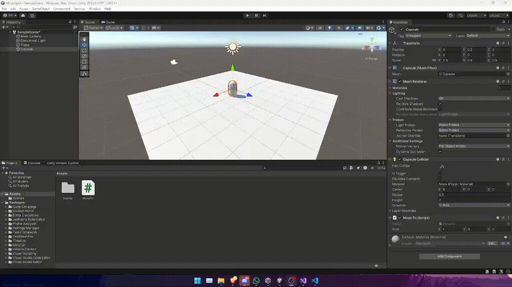
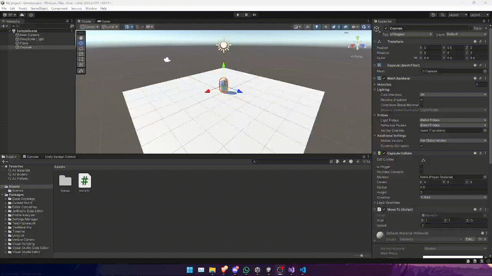
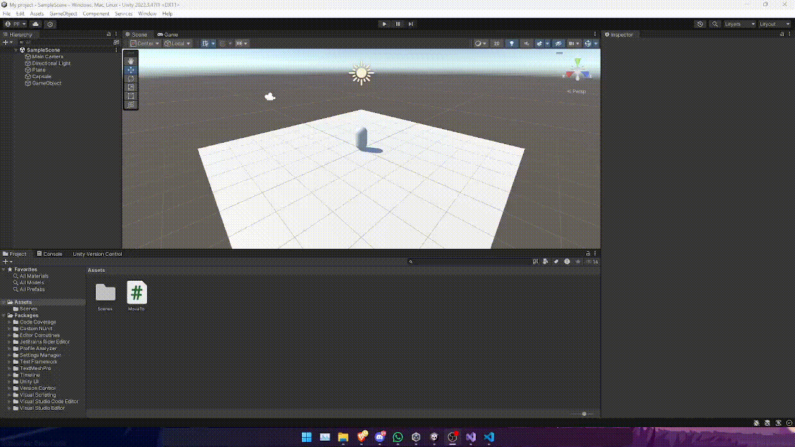
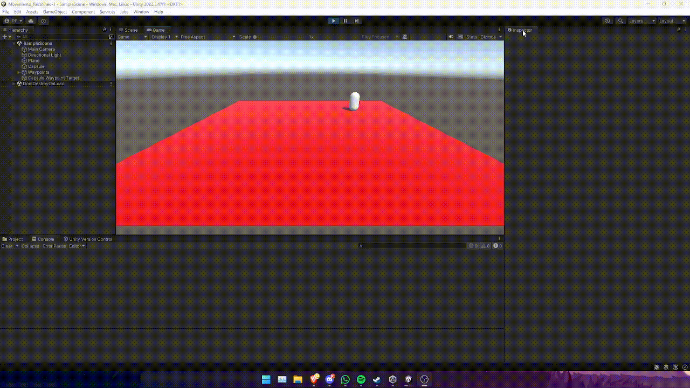

# Scripts - Movimiento rectilíneo

En este README voy a detallar lo que realice en la actividades de la entrega.

## Actividades 

### Actividad 1

a)

Cree el script MoveTo que se encarga de mover un objeto desde su posición hasta otra posicion. Está posición viene dada por otro gameObject, el vector del mismo se almacena en la variable ```goal```. 
> Este script lo he ido modificando para adaptarme a los requerimientos de cada actividad.


*Figura 1: Fichero MoveTo*

En está primera iteración el script manda a toda velocidad la capsula en dirección a la posición dada por el ```goal```.

b)

Configure la variable ```y``` para que sea igual a 0 y me di cuenta de que no pasaba gran cosa, sigue teniendo el mismo comportamiento que en el apartado anterior.

c)

Al poner el valor de la ```y``` a 1 tampoco cambia demasiado.


*Figura 2: Modificar valores en el inspector*



En este gif se muestra un ejemplo del movimiento que realiza la capsula, la cual se mueve a toda velocidad.

d)


e)

Al duplicar los valores ```xyz``` y usando un Debug.Log se puede comprobar que los valores no se mantienen consistentes.

### Actividad 2

En la siguiente imagen se puede ver el script resultante de la actividad. En está actividad tuve que crear la variable ```speed```, normalizar el vector de ```goal``` y usar la variable ```Time.deltaTime```. Y luego dentro del método ```Translate``` multiplicar los 3 valores anteriormente mencionados. Se multiplica todo por ```Time.deltaTime``` con el objetivo de obtener una consistencia en el movimiento y que el objeto no dependa de que tan potente es tu ordenador. Aunque el objeto seguira volando hasta el infinito.


*Figura 3: Modificaciones en el script MoveTo*



### Actividad 3

A diferencia de la actividad anterior es que en está se ha dejado de utilizar la dirección del objetivo y ahora el objeto se mueve hacía la verdadera posición del objetivo.


*Figura 4: Modificaciones en el script MoveTo*



Ejemplo del funcionamiento con estas nuevas modificaciones.

### Actividad 4

En está actividad solamente se añadio el rayo que apunta hacía el objetivo.


*Figura 5: Rayo apuntando hacía la posición objetivo*

### Actividad 5

En está actividad tuve un problema por culpa de los starter assets, ya que al intentar importarlos al proyecto resulta que este perdía todas las texturas. Por lo tanto, tuve que crear un proyecto nuevo para está actividad en concreto.

En este nuevo proyecto por defecto he utilizado el mismo script que el proyecto anterior, ```MoveTo```. A este script le he añadido el método ```Increase Speed```, que me permite aumentar la velocidad de la capsula. Está función va a ser invocada cada vez que el jugador pulse la tecla de espacio.

Esta función me ha ayudado en el último apartado de está actividad para aumentar la velocidad del objeto.


*Figura 6: Modificación en el Script MoveTo*

Para poder añadir los controles tuve que modificar ligeramente dos scripts. ```FirstPersonController``` y ```StarterAssetsinput```, estos scripts están relacionados con las ```InputActions``` del jugador. Además, hay que añadir un control dentro del ```ActionMap``` **Player** para poder ir aumentando la velocidad con cada pulsación de la tecla espacio.


*Figura 8: InputActions de los Starter Assets*

Y dentro del fichero ```FirstPersonController``` añadí la variable pública enemy. Está variable almacena una referencia a el script ```MoveTo``` que está contenido en la capsula y así poder invocar al método ```Increase Speed```.


*Figura 9: Script de FirstPersonController en la jerarquía*

En la siguientes imagenes se muestran los cambios que hice en los scripts de ```FirstPersonController``` y ```StarterAssetsinput```. 

.png)

*Figura 10: Cambios en FirstPersonController*

.png)

*Figura 11 Cambios en FirstPersonController*

.png)

*Figura 12: Cambios en StarterAssetsinput*

.png)

*Figura 13: Cambios en StarterAssetsinput* 


En este gif se muestra el funcionamiento como resultado de todo lo realizado en la presente actividad.

### Actividad 6

a) Realizar un script que gire al personaje hacia su objetivo para llegar hasta él desplazándose sobre su vector forward local.


*Figura 14: Modificación en la función Translate de MoveTo*

En este caso el objeto se va a mover en la dirección del vector forward, no a la posición objetivo.

b) Realizar un script que gire al personaje y lo desplace hacia su objetivo sobre la dirección que lo une con su objetivo. Normalizar la dirección para evitar la influencia de la magnitud del vector


*Figura 15: Modificación en el método Update de MoveTo*

En este caso la capsula se queda dando vueltas alrededor del punto objetivo.

c) Realizar un script que gire al personaje y lo desplace hacia su objetivo en la dirección que lo une con él, respecto al sistema de referencia mundial. Normalizar la dirección para evitar la influencia de la magnitud del vector.


*Figura 16:  Modificación en la función Translate de MoveTo*

Con estas últimas modificaciones el objetivo se mueve correctamente a la posición del objetivo.

### Actividad 7

a) Controlar el jittering utilizando la magnitud de la dirección.


*Figura 17: Añadir la reducción de jittering*

Como se puede ver en la siguiente imagen al controlar el jittering el objeto consigue llegar a la posición exacta del objetivo, no como ocurría con anterioridad.


*Figura 18: Redución de jitter en el editor*

b) Dado que la dirección nos la da la separación entre el objetivo y el personaje, también podemos controlar el jittering utilizando la distancia entre los dos puntos.


*Figura 19: Redución de jitter usando la distancia*

Este segundo apartado simplemente muestra otra manera de poder controlar el jittering.

### Actividad 8


*Figura 20: Uso de Slerp*

En este caso, no tiene mucho sentido mostrar el funcionamiento ya que la capsula simplemente se mueve hacía el objetivo de manera más uniforme.

### Actividad 10 


*Figura 21: Circuito que debe seguir la capsula*


*Figura 22: Script que permite al objeto seguir hasta el siguiente objetivo dentro del cicuito*

### Actividad 11



Gif que muestra a la capsula siguiendo el cicuito.
